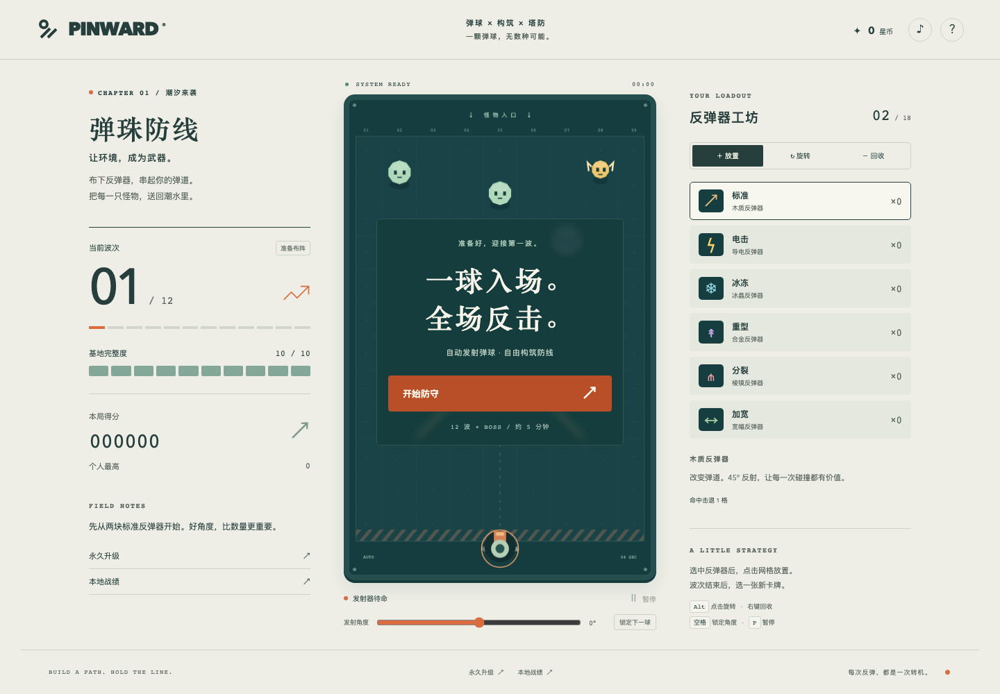

# PINWARD · 弹珠防线

一颗弹球，无数种可能。放置和旋转反弹器，用弹道守住基地。



基于 [supergames #1](https://github.com/zidanDirk/supergames/issues/1) 实现的完整第一章节：原生 ES Modules、Canvas 2D、Web Audio，无运行依赖、无构建步骤、无外部素材请求。

## 运行

需要 Node.js 22 或更高版本：

```sh
npm start
# 打开 http://localhost:4173
```

也可以把本目录交给任意静态服务器。ES Modules 需要 HTTP 服务，请勿通过 `file://` 直接打开 HTML。部署时保留目录结构，支持子目录部署。

同一 Wi-Fi 下测试手机：`HOST=0.0.0.0 npm start`，然后访问电脑的局域网 IP 和 4173 端口。Service Worker 和安装功能需要 HTTPS 或 localhost；普通局域网 HTTP 仍可运行游戏。

## 游戏内容

- 9×14 弹球台，中间 10 行可布阵；10 点基地血量。
- 12 波防守 + 三阶段深潮章鱼 BOSS，完整流程约 5 分钟。
- 标准、电击、冰冻、重型、分裂、加宽共六种反弹器。
- 普通、迅捷、坦克、炸弹四种怪物，波次递增强化。
- 每 4 秒自动发球；±15° 下一球瞄准；弹球在闭合球台内反射，18 秒后回收，分裂小球持续 8 秒。
- 每波结束三选一卡牌，6 秒后自动选择第一张；BOSS 前可免费重抽一次。
- BOSS 随机排列吞噬、潮群、重潮三种机制，切换时有阶段提示、慢动作和震动。
- 合成音效和三阶段 BOSS 节奏；静音、暂停、切后台自动暂停；尊重减少动态效果设置。
- 最高分、最高波次、构筑类型、剩余血量和五条本地战绩；跨局星币可购买额外初始反弹器（最多 4 块）及开局配置二选一。
- 响应式桌面 / 手机界面；PWA 清单、图标与离线缓存。首次联网加载后可离线游玩。

第二章节、第二 BOSS、共鸣连线、图鉴和构筑分享短码属于 issue 的后续打磨项，未包含在本次 MVP。

## 操作

| 操作         | 桌面                                 | 手机 / 通用                               |
| ------------ | ------------------------------------ | ----------------------------------------- |
| 放置         | 选择库存后点击网格                   | 单击网格                                  |
| 旋转 45°     | Alt + 点击；棋盘聚焦后 R             | 长按 0.8 秒；或选择「旋转」工具后单击     |
| 回收返还库存 | 右键；Delete / Backspace             | 双指长按 0.8 秒；或选择「回收」工具后单击 |
| 瞄准下一球   | 滑块调整，空格锁定                   | 滑块调整，点「锁定下一球」                |
| 暂停 / 恢复  | P / Escape / 暂停按钮                | 暂停 / 继续按钮                           |
| 键盘布阵     | Tab 聚焦棋盘，方向键移动，Enter 放置 | —                                         |

旋转和回收无消耗，可在防守过程中随时调整。卡牌只加入库存，需要再点网格放置。选牌过程中切后台会冻结倒计时，返回后可点「继续选牌倒计时」。

## 验证

```sh
npm run check
npm test
```

测试使用 Node 内置测试运行器，无需 `npm install`。覆盖 51 项物理测试、特效和库存规则、卡牌超时、BOSS 机制、存储容错以及 8 组固定随机种子的完整通关模拟。通关模拟使用固定布局，并等待选牌窗口接近结束后选择电击 / 分裂优先的卡牌。

可选浏览器测试使用独立安装的 Playwright，不属于游戏依赖：

```sh
# 另一个终端先运行 npm start
PLAYWRIGHT_MODULE=/absolute/path/to/playwright/index.mjs node tests/browser.mjs
# 只检查 WebKit
TEST_BROWSER=WebKit PLAYWRIGHT_MODULE=/absolute/path/to/playwright/index.mjs node tests/browser.mjs
```

测试输出与截图保存在已忽略的 `test-results/`。平台覆盖、性能测量与未实测项见 [验证记录](docs/validation.md)。

## 结构

| 文件                            | 职责                                             |
| ------------------------------- | ------------------------------------------------ |
| `src/game.js`                   | 纯逻辑状态机、实体生命周期、碰撞后的游戏效果     |
| `src/physics.js`                | 圆 / 线段接触、反射向量、重力积分、墙面边界      |
| `src/entities.js`               | 反弹器、弹球、怪物定义和工厂                     |
| `src/waves.js` / `src/cards.js` | 波次、BOSS 机制、卡牌抽样与保底                  |
| `src/renderer.js`               | Canvas 绘制、插值、粒子池、预警与伤害反馈        |
| `src/main.js`                   | PointerEvents / 键盘操作、DOM、弹窗、60Hz 主循环 |
| `src/audio.js`                  | Web Audio 合成、命中节流、BOSS 节奏              |
| `src/storage.js`                | 本地存储验证、结算和跨局成长                     |
| `sw.js`                         | 同源静态资源的联网更新和离线回退                 |

逻辑固定为 60Hz，渲染插值；碰撞子步将弹球每次位移限制在 4px 内。上限为 18 块反弹器、18 颗弹球、24 只怪物，粒子池固定 240 个。音效在用户首次操作后解锁，相邻 80ms 内的命中音合并节流。所有美术均为本项目的程序绘制，没有第三方素材许可依赖。
